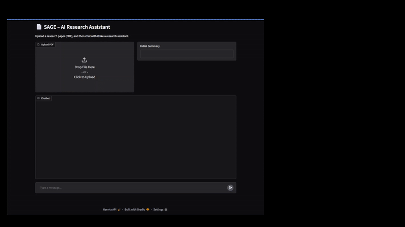

# 📄 SAGE – AI Research Assistant

**SAGE** (Summarize, Analyze, Guide, Extract) is an AI-powered research assistant that helps you interact with academic papers like a co-reader.

You upload a PDF and ask natural language questions like:
- "What is this paper about?"
- "Summarize section 3.2"
- "Why is this paper considered influential?"

It's built using:
- OpenAI (GPT-3.5)
- LangChain
- PyMuPDF (for PDF parsing)
- Gradio (chat UI)

---

## 🚀 Demo



> 🧠 Uploads “Attention Is All You Need” and chats about the core ideas using GPT-3.5.

---

## 🧰 Features

- 📄 Upload any PDF (research paper, report, etc.)
- 🧠 Summarize entire documents using GPT
- 💬 Ask section-specific questions
- ⚡️ Runs locally or on Hugging Face Spaces

---

## 📦 Installation

```bash
git clone https://github.com/mannat1230/sage.git
cd sage
pip install -r requirements.txt
python ui/gradio_app.py

